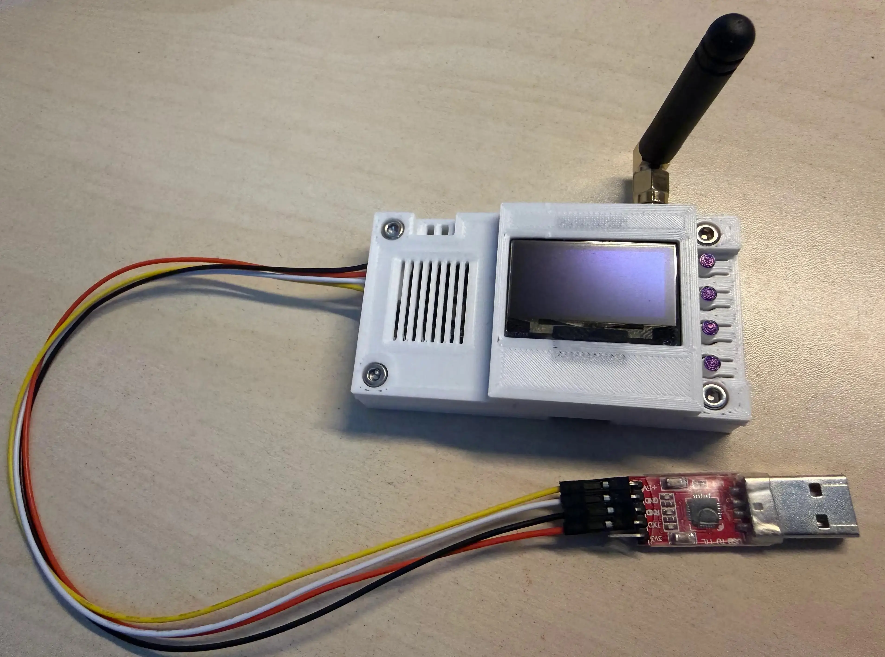

# Data_Recorder_ESP32
# ESP32-S3 High-Performance Data Logger

## 高性能 ESP32-S3 数据记录仪

[English](#english-introduction) | [中文介绍](#中文介绍)

---
<a name="english-introduction"></a>
## 🌍 English Introduction

This project implements a high-reliability data logging system based on the ESP32-S3. It captures high-speed data streams from a UART interface, simultaneously storing them to an TF card (supporting hot-plugging and safe ejection) and transmitting them remotely via Wi-Fi (UDP).

### Key Features

* **Multi-Tasking**: Leverages FreeRTOS dual-core scheduling (Core 0/1) for seamless data processing.
* **Structured Storage**: Includes a 256-byte binary header for versioning, baud rate tracking, and device identification.
* **High-Speed UART**: Optimized 16KB buffer design for high-baud rate continuous throughput.
* **Intelligent File Management**: 5MB auto-split strategy with crash-safe buffering and automatic header injection.
* **Robust SD Handling**: Real-time pin detection, supporting physical hot-plugging and auto-remounting.
* **Interactive HMI**: OLED-based multi-page menu system for real-time status monitoring and user control.

---
<a name="中文介绍"></a>
## 🇨🇳 中文介绍

本项目基于 ESP32-S3 实现了一款高可靠性的高性能数据记录系统。系统能够从 UART 接口采集高速数据流，并同步将其存储至 TF 卡（支持热插拔与安全卸载）或通过 Wi-Fi (UDP) 进行实时远程传输。

### 主要功能特性

* **多任务调度**：采用 FreeRTOS 跨核心（Core 0/1）调度，实现采集与传输的完美解耦。
* **结构化存储**：自定义 256 字节二进制文件头，支持版本管理、波特率记录与设备标识。
* **高速 UART**：设计 16KB 大缓冲区，确保高波特率下的连续数据吞吐。
* **智能文件管理**：支持 5MB 自动分卷存储，具备防损毁缓冲与自动表头写入机制。
* **SD 热插拔**：实时检测引脚状态，支持物理拔插后的自动重新挂载。
* **实时交互界面**：基于 OLED 的多页面 HMI 菜单，支持状态监控与按键控制。

---

### 💡 Technical Details (技术细节)

#### Structured Log File Header | 结构化日志文件头

The system uses a custom binary header for data traceability:
系统采用自定义二进制文件头以保证数据可追溯性：

```cpp
typedef struct {
    uint32_t magicWord;       // Identification Code (0xAABBCCDD) | 身份验证标识
    uint8_t  version[4];      // Version Number | 版本号
    uint32_t baudRate;        // Baud Rate | 波特率
    uint32_t createTimeMs;    // Creation Time (ms) | 创建时间
    char     deviceName[16];  // Device Name | 设备名
    uint8_t  padding[224];    // Reserved Space | 预留空间
} LogFileHeader_t;

```

#### Hardware Mapping | 硬件引脚映射

| Peripheral | GPIO | Description |
| --- | --- | --- |
| **LED_SYS** | 15 | System Status Indicator |
| **SD_CD** | 8 | SD Card Detection (Active Low) |
| **I2C** | 1, 2 | SDA/SCL for OLED Display |
| **UART** | 18, 17 | RX/TX for Data Stream |

---

### 实物展示 (Physical Prototype)
<div align="center">
  
  <p>图： Data Recorder 实物</p>
</div>

---

### ⚠️ Development Notes (开发注意事项)

1. **SD Card Formatting**: Please ensure the SD card is formatted as **FAT32** for optimal compatibility.
2. **Safe Ejection**: Always use the "Safe Eject" function (Long Press the **BACK** button on the HMI) before removing the SD card to ensure file integrity.
3. **Internal Pull-ups**: Input pins are configured with `INPUT_PULLUP` to match standard hardware button matrix designs.
4. **SD 卡格式化**：请确保 SD 卡已格式化为 **FAT32** 格式以获得最佳兼容性。
5. **安全卸载**：拔出 SD 卡前，请务必使用“安全卸载”功能（长按 HMI 界面上的 **BACK** 键），以确保文件系统完整性。
6. **内部上拉**：输入引脚默认配置为 `INPUT_PULLUP`，以匹配标准硬件按键矩阵设计。